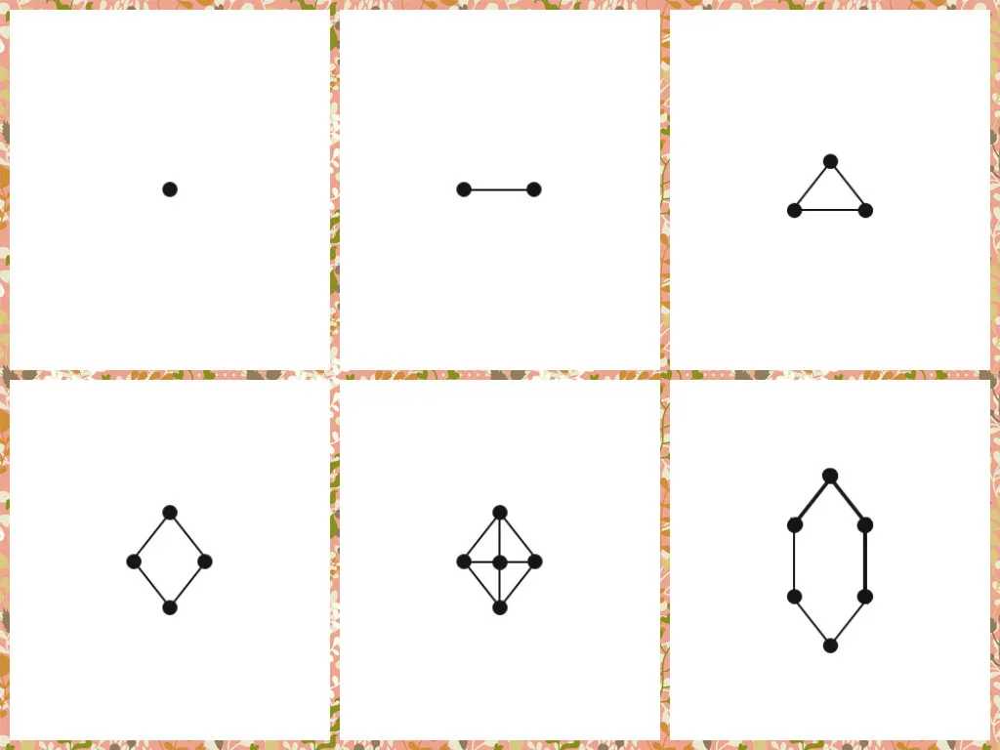
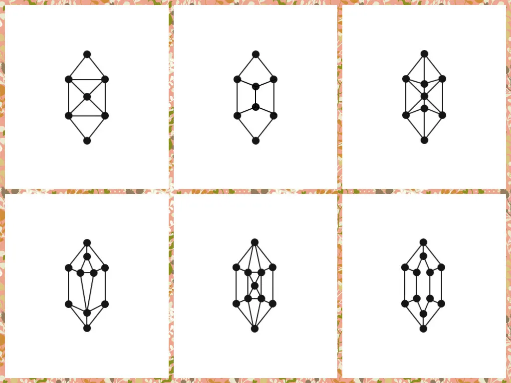
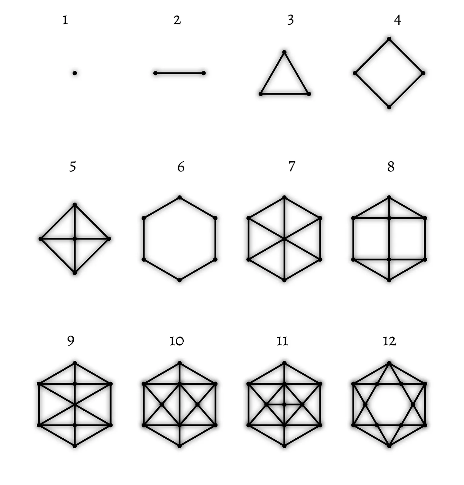

## Introduction into personal research

Hello, my name is Artur Kraskov and this is an introduction into my research and findings, outcomes and development.

It started in 2012 when I was studying Communications, Art & Technology at Simon Fraser University in Vancouver, Canada.

Several main references and questions were on my mind. For some reason they bothered me very seriously. And I still keep working on them:

- Symbols, symbolism, languages and their origins in a general sense
- Ideas of Marshall McLuhan and Media Ecology
- Overwhelmed media, polluted media and periodic extinction of means of communication and media due to pollution or latency

At some point I started to realise that human beings have very limited capacity to learn. 

As well, as different and unique beings we excel in different things and suck in other. Thus, the limitation is more serious and we depend on each other. I think every student at some moment in life understands it. There is simply not enough time to learn everything.
The most common way to learn something is through reading texts. And practicing problem solving by writing something. These two methods remain the same for thousands of years. And, in my opinion, this is a bottleneck in evolution. Human brains can develop, because their capacity to process natural language and text information are very low. Amount of information in the world grows with immense speed. Quintillions of GB of data are produced yearly.

Thus, there is no chance to cope with these amounts and process them in the same way as we used to do for centuries. We live in a critical moment where this change happens. Yet, there is no significant progress and no direction is outlined anywhere. No concept or solution that can substitute text effectively.

Many areas of study are still taught and will be taught by reading and writing. While the amount of information keeps growing. One of the most notable signs of progress in the direction to do something with texts are LLM models and multimodal models. However, humans still read and write. And it means that soon AI will occupy more media and user attention and humans using AI will reach the capacity — capacity for extracting information through reading will remain the same even if we use AI for processing. It will not increase because of LLM, maybe even decrease.

Back in time I didn’t know anything about LLMs. With or without it I see my research as a potential solution to the problem of limited capacity of the brain to process written text.
A plenty of similar research can be found in areas of information design, data visualisation, semiotics, design, etc. Maybe there are working concepts somewhere, but they are not popular at the moment of writing this paper. And no practical use case seems to be found anywhere. They definitely exist locally and in narrow areas. E.g. AR/VR, cards, infographics, special manuals or instructions for professionals, navigational systems.
General lack of effective text substitute solution thesis is supported by the current state of education system in the world and existing knowledge transfer practices — documentation, libraries, manuals, etc.

It is possible to find systems for blind or deaf people which allow translating text or information into systems different from text. And it is possible to find research about Brain-to-Brain communication systems which are chip or field based and can allow telepathy-like effects. While telepathy in its general sense can be close to something considered a change, the rest is way below required capacity.

Human of the future needs new solutions. Reading news is too slow, while events happen too fast. And the pace keeps growing.

It was clear for me 10 years ago, it is still very important and actual and it was clear for McLuhan in the previous century. It was also stated by WGSN in their 2024 Future Consumer Report. Thus, there is some logic and sense in it. And it makes this paper worth reading for you. Or can make.

Back in 2011–2012 I was very fascinated by ideas of other forms of life, non biological or immaterial life forms. It is still pretty interesting. And they are very good for theoretical modelling.

In particular, assume a higher form of consciousness exists. If it has no material body and has a type of consciousness which can be considered higher, stronger and more effective than a human can have, what will it be?

Today we can think of AI, AGI. It is good. Let’s consider a less technical example with less available research. Assume it is a consciousness in space. Just a bigger one and there are several like this one. What will be their language or way of communication?

For some reason I decided that it would be a direct multidimensional projection/transfer of information. E.g. the whole life of a human being in one file with visual representation. Instantly. A whole life of a city, country, planet. This way of communication is different from one that humans have. There is no time in it, because there are no material bodies involved in the process.

If there are no material bodies, then there is no media. And if there is no media, then no need to encode, transfer and decode information. It all happens instantly and in the exact form as it is without any decoding or encoding. Direct communication.

This vision represented a solution of human communication problems coming from the text or natural language and the need to process it. Trying to make any use out of it I made a lot of prototypes and attempts which will be summarised below. In general I found out that human perception can be changed and it already opens a lot of new possibilities. 

Limitations are in the way we are used to deal with information.

Practical use can be narrowed to the ability of making a scheme or a sketch of any process or problem. Decomposing it and solving or explaining it to others. Yet, in my opinion, in order to obtain faster communication with this method requires it to be regularly practised by a group which will use it for communication.

And it seems impossible to prove it without using it. While using it requires it to be learnt. And learning requires time which is currently already scarce for many people. My objective is to transfer this solution and concept without taking the time of users to learn it. Or at least by making it interesting and enjoyable to learn it.

On the other hand, I see how fast technological progress is going and assume that these types of solutions will be more demanded in the future. And hope to make my fortune then with available concepts and prototypes ready to be used by busy people of tomorrow. Unfortunately, there are many wars and cataclysms which are also results of rush, fast pace of technological progress and overwhelming of media and overstimulation of brains. Thus, I assume that this work will be valuable and beneficial for many people and the world in general.

Hopefully, one day the civilisation will learn to process information differently and it will play a crucial role in understanding complicated things which we don’t have to understand now — consciousness, collective well being, peaceful coexistence, relaxation, intuition and others.

It appears that in order to become able to transfer and process information in the described visionary way an ordinary human being must evolve. Many areas of being must be transformed. The way of thinking or a mindset, the way of perceiving the world, the way of dealing with information, the way of solving problems, saving information and communicating it to others.

And if many beings evolve then a society with an enhanced cognition and means of communication can be imagined. The speed of communication, learning and decision making will speed up. Informational processes will go much faster.

It is possible to say that we already face it today — with our devices we are much faster than older civilisations. Many jobs are automated. Yet, people still struggle. Nevertheless, we can recognise the increased amount of communication, transferred messages, and written books. We produce and consume a lot more information than before.

Now, let’s focus on the edge of capacity for a modern man deeply involved in scientific work. All sorts of technology are available. Great mind, knows a lot, can do a lot, very fast and responsive. One of the main challenges becomes innovation. Same for a war general or a passionate teacher.

At the edge one must be very creative in order to produce innovation, find a life saving solution or make a system to prepare students for the future effectively. None of these knows exactly what will be the outcome — innovation doesn’t exist until it is done, war is not won or lost until then, and the future is not here and is not observable until it becomes now. Something must be done in order to succeed.

This is where heuristic comes into play. It is considered that the human brain engages into the most complicated processes when solving creative problems. And it is understandable or clearer when dealing with things like innovation, war, crime prevention, the future of societies, nations, countries or the world. Big problems/tasks naturally overload or load enough the brains that deal with them.

Besides the brain body and self/memory/soul also play an important role in problem solving. It is offered to address communication as a problem in this context. Thus, general human being/presence on all levels of existence must be taken into account when dealing with enhanced communication development. Or limitations of natural language and overcoming them.

The solution is a means of communication. The one that a superior intelligence in the example above can have. The document below is a summary of the research and serves a general purpose — to introduce the topic and the concept to the user. It is not a final version and not a complete solution, not a how to use it or getting started guide.

As well I had some sort of foreseeing or intuition that it is possible to speed up information processes in a new way. I was writing essays and trying to formulate my ideas. They were very intuitive and I followed the feeling more than thinking.

Later it indeed appeared to be possible. Earlier I was thinking about the middleman role — placing more and more “middlemen” in any informational process. And named it Informational Catalysis. Today it is clear that LLM, neural networks, code or some analog life hack can work for us as intelligence in between words in the text, letters, any type of data and media.

And I had a feeling of some patterns existing behind the scenes on a meta level. This feeling or sense mostly led to the development of the solution.

The importance of numbers and digits is more significant than generally acknowledged. Numbers can and often do indicate categories and forms. Two, three or four people in the room will significantly change the state and dynamics of the system. Thus, groups of 1, 2, 3, 4, etc. people are different and form different patterns. While a casual perspective can avoid making a lot of difference based on simple increase in number.

Various unrelated and over complex comparing to mere numbers or digits processes like consciousness, intelligence also depend on numbers. Two centres of focus is already a pretty big challenge for an ordinary human. While unconscious processes in any body can be counted in billions. Billions form clusters and they form patterns. Trying to split attention into two or more concurrent actions is a skill that requires training. And will be often prohibited by law e.g. driving and holding a phone with one hand. Playing games and doing homework, being a sportsman and an alcoholic. When it comes to assessing or making judgements related to thousands or millions of people, understanding systems complexity and growth is related to understanding numbers. Statistics is related to numbers.
Some numbers can be better understood through their visual representation. When several visual representations are combined a new quality of understanding of related processes can be achieved. E.g. graphs, diagrams, charts.

Numbers or digits represent dimensions and dimensions can be illustrated or expressed geometrically.

These were some preliminary research stage observations and concepts I was working with. Combined with a feeling for patterns and symbols I was trying to accumulate my research. First of all, in my own memory, I was iteratively returning to the concept of a better means of communication which is hidden or exists in geometry and digits.

I assume that my brain was solving a creative problem. I was also stressed by the changing environment and a need to explain to my parents why I dropped the university and how I was going to live further. Eventually, one morning after a party I came up with an idea. All night I was trying to explain these concepts to some of my old friends. And in the morning I had an insight.

Symbols development in relation to numbers is natural. Geometry follows this logic. And it clearly expresses and represents human life. I drew a sequence of symbols and attached meaning to them. Each symbol indicated a period or state in human life.

The sequence became with zero as nothingness or emptiness in which a world or something can exist. The second symbol was a dot and it represented human birth. All other symbols represented ages. What is interesting is that cycles of human development before birth and during the first several years of life are mimicking evolution of the whole life on Earth. Body develops similarly to how life was going through evolution processes and developed organs. And after birth a child learns similarly to how human civilisation obtained its current state. All in one life.

The general pattern was within the first twelve symbols and indicated the end of cycle — realisation of the full potential. However, I drew more patterns and had meanings for them. They kept coming as the geometric complexity was growing and using previous images as visual heuristics. That time I didn’t know about heuristics, but after learning it I can say that it was a heuristic process in action — creating new representations and using them to build new levels of complexity.

Originally I had these symbols:
Press enter or click to view image in full size

Old symbols 1 to 6 

Old symbols 7 to 12

Later I updated them to be perfect for geometric building.

New symbols 1–12

The principle of their construction was coming to me together with a merged vision of crystal growth and formation and human growth and various stages/processes in life.
The general idea was that new dots appear until 5 and 6 externally and form a border. While next dots appear due to intersections of lines and represent a process of growth. New edges and planes appear and form centres. This is related to some abstract forces and tension.
Initially, I had more of an abstract crystal growth vision. Later I built shapes that represented the ideal or best option for adding new dots through the intersection of lines. This is the only one sequence — there is no alternative with the same rules.

In other words, the sequence geometrically represents the natural development and it is very easy to derive or represent it logically with natural language or statements. Somewhere at that time or earlier I realised that they were programmable — there can be many processes that can be expressed in a similar way.

From that I derived that it seemed to be possible to express any process with these symbols. And that made them universal, in my opinion. I called this sequence a “universal matrix”. More reflection and work with it allowed me to develop a conceptual philosophy which I related to time.

Since symbols are universal and can represent any process they can be seen as eternal or existing beyond the material plane in the abstract ideal world. If any process can be expressed with them, then it is possible to uncover them or find them anywhere. Thus, they are everywhere. And if they are everywhere and we don’t see them, but see changes, then they are somewhere inside either as information, code or principle/law.

Most closely this sequence resembles time. Time flow in the universe can be seen as solid — we can’t extract time, can’t find it anywhere, but it clearly exists and we use it everyday. It is a necessary thing for changes, which represent life and universe in ordinary perspective.

We can only see anything in the world because of the presence of time. No time = no changes. No changes = nothing to see. “One cannot enter the same river even once.” Atoms and particles fluctuate and move.

And certain cyclical patterns are going through distinctive and distinguishable stages. Birth, growth, some activity, shrinking, death. It can be found in many places and processes.

These stages to some extent reflect abstract geometric symbols. However, I had a clear idea in my initial vision — the twelfth symbol is not death. Goal of life is not death rather the fullest possible realisation of the potential of oneself.

Thus, the natural pattern (because it is geometrically perfect and right) leads to a different conclusion. Returning to the initial quest of super intelligence’s language and better means of communication it is possible to draw a parallel — transferring multidimensional process/information fast can also be seen as a 12th step sequence.
And it can be any process — life of a human, non living item, life of the solar system, universe can be too.

Probably, this is the most valuable outcome. In theory anyone can express anything with it. And it will always remain the same 12 symbols. Can be more or less, but a general pattern or a standard can be with the 12 step sequence. And it is pretty easy to understand why — it is enough to build the best perfect shape, a hexagon through 6 steps and then repeat it and form a basis for a fractal.

Can be used like a binary system. E.g. one byte — 12 symbols. However, there are more dimensions than with 1/0s. Symbols can have colours, attached data and more. Yet, some correlation exists. It will be explained in more detail further.

The question of dimensions and musical harmony are worth mentioning in relation to these symbols. Dot is 1D plane, line is 2D, 4 dots will form a complete plane, while 3 dots allow to form an angle, where one dot is static and another is moving. The fifth dot can already represent a point in another plane and form a 3D shape. However, this theory is updated in relation to informational processes.

The fifth dot represents a centre of a plane signifying the most real scenario or the highest probability for a certain possibility.

Further work with the meaning of symbols and their relations produced numerous interpretations. Some are purely intuitive, while others are algorithmic.
Musical theory can be very useful to understand the intuitive part. In particular, sounds can be visualised. Sounds are frequencies and frequencies can represent dimensions. This can be expressed in digits or symbols. And also in colours. In addition to initial recognition of the importance of numbers for perception, colours can also be seen as having significant importance. E.g. continuous seeing sky, city, grass, forests and other natural phenomena of a certain colour, seeing colour attached to important archetypes (mother, father, school, food, home, groups, animals, etc.) can form deeply rooted subconscious and unconscious reactions.

I combined symbols and colours and produced a deck of cards. However, there is more to be done with colouring these symbols. Ideally, dots and lines can have different colours too. The deck of cards was made from 12 colours and 12 symbols. Each colour has a sequence of developing figures.

When making cards for printing I realised that CMYK colours can produce a limited number of shades. However, an ideal form will be a deck of 144 unique shades ranging from red to pink like in a colour circle.

It is worth nothing, that initial vision was a crystal. And before I liked to visualise it filled with light. A crystal of light.

After writing the sequence down and decomposing the process of crystal growth as morphing or changing shapes/patterns I could understand that this vision was an interface of the future. It is a data structure or a database that can be accessed and manipulated through interaction with a holographic or AR/VR structure. I was thinking a lot about 4D visualisation.

And if taking human life as an example than a crystal is a state of a body at each moment of time. When merged into one it is like a deck of cards. Each moment becomes compressed from the 3D body into a 2D card. However, the representation interested me more as a symbolic one rather than a digital twin. In symbolic representation dots or elements can be categories or indicators and change their state in relation to the human state’s change.
Envision zooming into a dot and finding a pattern in there. Similarly patterns can arise from dots. This can be a 4D representation in 3D/2D.

Then, one can use this crystal for communication. My initial utilisation concept was a social network. It was challenging modern for that time facebook and russian vkontakte (facebook clone). Their interface was around text and text-based content. A lot of fake and rubbish was present at that time already. And I was concerned about media ecology.
My interest was in making a better place where less useless content was present and more focus was given to making clear profiles which precisely depict users. Some hybrid of facebook and linkedin with the ability to add portfolio which was converted into statistics and symbols was on my mind.

In addition to symbols meaning as process stages I added colour intensity as fulfilment of these stages. It is the most clear with projects and production quality. Assume there is a standard for each stage or a happy path which I later found in process mining and there is actual realisation. They can be compared and measured and expressed as colours.
More ideas were about making numbers of skills be represented as patterns and coloured in relation to fulfilment.

At that time I had absolutely no knowledge of programming. But I had another feeling in relation to these symbols. One was previously for patterns. Then for interfaces and universal language. And another one appeared later and was about AI.

I could feel that there is some intelligence in this sequence. A pattern that can represent reasoning or decision making. And it can be improved with statistics. Which I later discovered as process standardisation heuristics and process mining.

That’s it for now. Some initial ideas and concepts to begin with. A lot was not included. E.g. enneagram and its mathematical origins NB! However, I think it is already a variety that can serve for future presentation of examples and use cases, prototypes and more futuristic ideas. All serve the same initial goal — to develop a better means of communication and solve overwhelmed media problems, provide faster learning and more capacity for information processing.

## Reference
https://www.researchgate.net/publication/382360492_Universal_Matrix_Definition_Visual_Proof_Visual_Heuristic_Logical_Chain